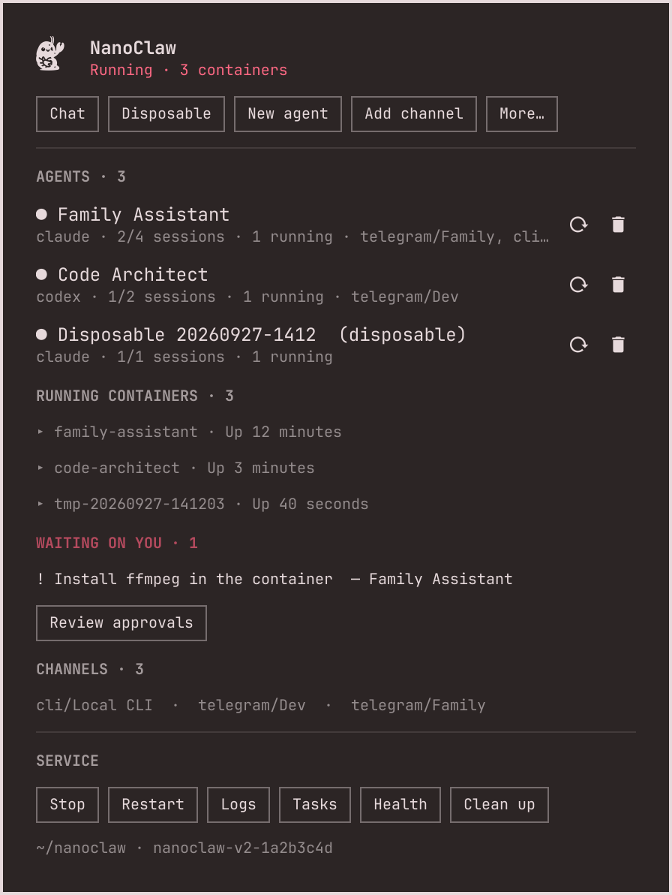

# NanoClaw for Omarchy

An unofficial [Omarchy](https://omarchy.org) plugin for
[NanoClaw](https://github.com/nanocoai/nanoclaw), the self-hosted AI assistant
that runs every agent in its own container. It puts NanoClaw on your bar and in
your menus: see what your agents are doing, chat with them, spin up throwaway
agents, add templates and channels, and clean up after yourself.



> Not affiliated with or endorsed by NanoClaw or Omarchy. See [NOTICE.md](NOTICE.md).

## What you get

- **Bar dashboard.** The NanoClaw mark on your bar, with a dot for the service
  (green running, red when something needs you). Click for service state, every
  agent with its provider, sessions, running containers and channels, pending
  approvals, and one-click actions. Right-click to chat, middle-click for a
  disposable agent.
- **Chat.** A terminal chat with your agent over NanoClaw's local channel.
- **Disposable agents.** A throwaway agent that answers the terminal while you
  use it and is deleted, with its files and containers, when you leave. Your
  other agents are muted meanwhile and restored exactly, even after a crash.
- **Templates.** Create agents from the public
  [nanoclaw-templates](https://github.com/nanocoai/nanoclaw-templates) catalog.
- **Channels and providers.** Add Telegram, WhatsApp, Slack, Discord, Signal
  and more, or Codex, OpenCode and Ollama, through NanoClaw's own setup skills.
- **Service control.** Start, stop, restart, and follow the logs.
- **Clean up.** Find leftover disposable agents, orphaned folders, stopped
  containers and stray watchers; it lists them and asks before removing
  anything, and archives folders first.
- **Default agent (optional).** Make NanoClaw your Omarchy default agent.
- **Management skill.** Teaches Claude Code, Codex or Hermes to operate
  NanoClaw for you.

## Requirements

- Omarchy 4 (Quattro shell) on Arch Linux
- Docker (NanoClaw runs its agents and credential gateway in containers)
- `git`, `python3`; `gum` for nicer prompts (ships with Omarchy)
- [Claude Code](https://claude.com/claude-code) for NanoClaw's own `/add-…` and
  `/customize` skills
- NanoClaw itself. The plugin can install it for you (below); NanoClaw's setup
  then installs Node.js and pnpm if missing, sets up the OneCLI credential
  gateway in Docker, and signs you in to your AI provider.

## Install

```bash
omarchy plugin add https://github.com/RohiRIK/omarchy-nanoclaw.git --enable
```

That adds the bar widget and nothing else. For the rest, run the optional
integration; it asks before each part and can be undone at any time:

```bash
~/.config/omarchy/plugins/rohirik.nanoclaw/bin/nanoclaw-integrate install
```

| Part | What it adds |
| --- | --- |
| `menu` | Setup › NanoClaw submenu and NanoClaw in Setup › Agent (entries between marker lines in `~/.config/omarchy/extensions/omarchy-menu.jsonc`, plus the icon font in `~/.local/share/fonts`) |
| `agent` | Routes Super+Shift+Ctrl+A and the `a` alias through NanoClaw's dispatcher so it can be your default agent (marked blocks in `~/.config/hypr/bindings.lua` and `~/.bashrc`); every other agent is passed straight to Omarchy |
| `app` | NanoClaw in Apps and the app launcher (`~/.local/share/applications/rohirik.nanoclaw.desktop` and its icon) |
| `commands` | `nanoclaw-ctl` and NanoClaw's `ncl` on your PATH (links in `~/.local/bin`) |
| `skill` | The management skill, linked into `~/.claude/skills`, `~/.codex/skills`, `~/.hermes/skills` where those exist |

Install a single part with `nanoclaw-integrate install menu`, and check what is
installed with `nanoclaw-integrate status`. Files are backed up
(`*.bak.rohirik.nanoclaw.<time>`) before they are edited.

### Installing NanoClaw

If NanoClaw isn't installed, the dashboard shows **Install NanoClaw**, or run:

```bash
~/.config/omarchy/plugins/rohirik.nanoclaw/bin/nanoclaw-ctl setup
```

It asks first, clones NanoClaw to `~/nanoclaw` at a pinned, tested commit, and
runs NanoClaw's guided setup in the terminal. After that, NanoClaw updates
itself with its own `/update-nanoclaw` skill. If setup stops partway, run the
same command again to resume.

## Using it

| Where | What |
| --- | --- |
| Bar | Left click: dashboard. Right click: chat. Middle click: disposable agent |
| Dashboard keys | `r` refresh, `c` chat, `d` disposable, `Esc` close |
| Menu | Setup › NanoClaw (with the `menu` part), or `omarchy menu summon ncl` |
| Terminal | `nanoclaw-ctl --help` |

```bash
nanoclaw-ctl setup                        # install, resume or repair NanoClaw
nanoclaw-ctl service start|stop|restart|status|logs
nanoclaw-ctl agents                       # list agents
nanoclaw-ctl main [folder]                # make an agent answer the terminal chat
nanoclaw-ctl template-create [ref]        # create an agent from a template (no ref: pick one)
nanoclaw-ctl disposable                   # throwaway agent, deleted on exit
nanoclaw-ctl channel [name]               # add a channel (no name: pick one)
nanoclaw-ctl provider codex|opencode|ollama-provider
nanoclaw-ctl tasks | approvals
nanoclaw-ctl clean                        # leftovers; lists them and asks first
nanoclaw-ctl agent-delete <folder>        # type the name to confirm; backed up first
nanoclaw-ctl migrate-openclaw | customize
```

### Deleting and cleaning up

`agent-delete` asks you to type the agent's name, then archives its folder and
session data to `~/.local/share/rohirik.nanoclaw/backups/` before deleting it.
`clean` never touches your real agents, their memory, or the credential
gateway; orphaned folders it removes are archived to the same place first.

### The terminal chat

NanoClaw's terminal channel sends each message to every agent wired to it. If
the chat gets no reply after setup (NanoClaw removes its setup agent without
wiring your template agent to the terminal), run `nanoclaw-ctl main`; the chat
also does this for you when nothing is wired.

## What it touches

Without the optional integration, the plugin only writes to:

- its own `state/` folder (chat history, bookkeeping)
- `~/.cache/rohirik.nanoclaw/` (the template catalog at a pinned commit)
- `~/.local/share/rohirik.nanoclaw/backups/` (archives made by delete and clean)
- `~/nanoclaw` when you install NanoClaw, and NanoClaw's own data through its
  `ncl` command

It runs `systemctl --user` only for NanoClaw's own unit, and `docker` only for
containers labelled as NanoClaw's (plus `ncl-bench-*` test containers from
`nanoclaw-runner`). No sudo or pkexec is required, and it stores no credentials; NanoClaw's
credential gateway holds those.

Upstream code is fetched at exact commits (NanoClaw, and the template catalog
whose MCP servers and skills NanoClaw runs) and checked out before anything
executes. Like every Omarchy plugin, it runs unsandboxed: read the source first.

## Remove

```bash
~/.config/omarchy/plugins/rohirik.nanoclaw/bin/nanoclaw-integrate remove
omarchy plugin remove rohirik.nanoclaw
```

`nanoclaw-integrate remove` takes out exactly what `install` added. To remove
NanoClaw itself as well, use its own uninstaller:
`cd ~/nanoclaw && bash nanoclaw.sh --uninstall` (add `--dry-run` to preview).

## Development

```bash
for t in tests/*.sh; do bash "$t" || echo "FAILED: $t"; done
```

The tests run against fake NanoClaw checkouts and throwaway home directories;
they never touch your real agents or config. One test starts short-lived
`alpine` containers to check isolation; it needs Docker.

Rebuild the icon font from the logo with
`uv run --with potracer --with fonttools --with pillow --with numpy --with scipy python assets/build-icon-font.py 40 3`.

## License

MIT, see [LICENSE](LICENSE). The NanoClaw logo is used under NanoClaw's MIT
license; see [NOTICE.md](NOTICE.md).
